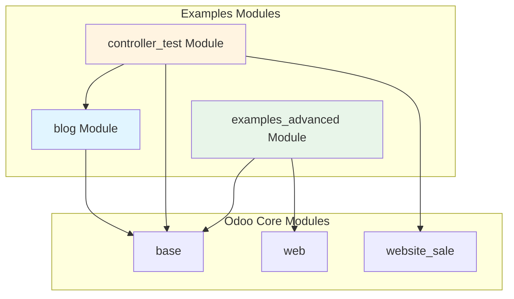
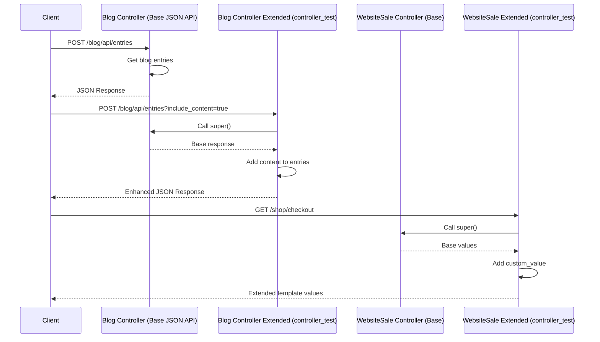
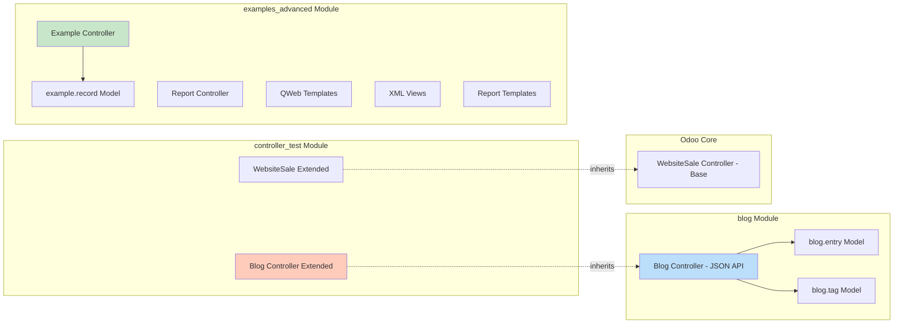
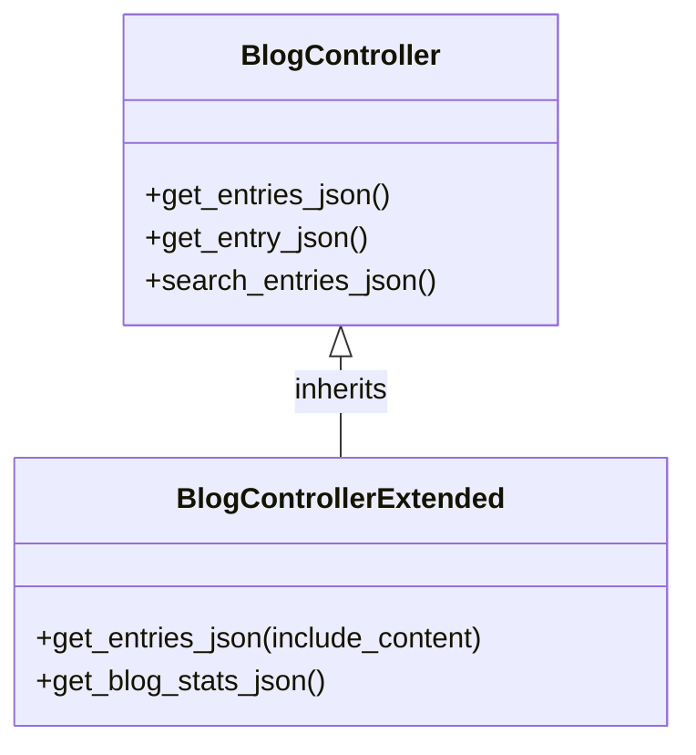
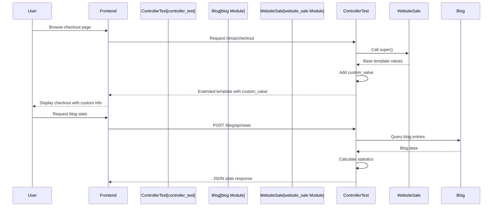
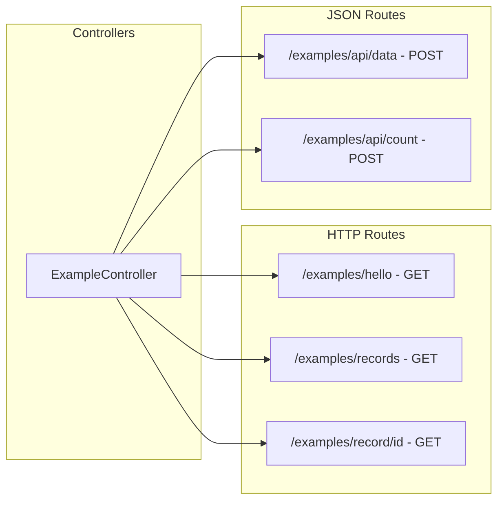
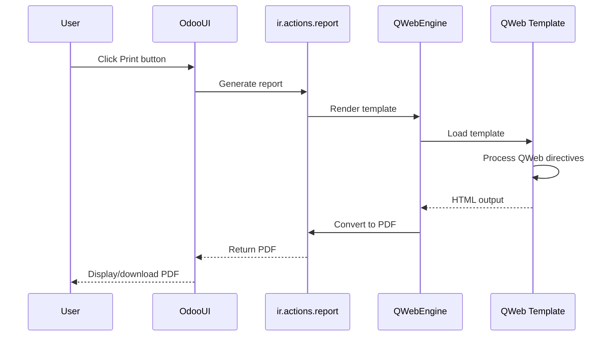
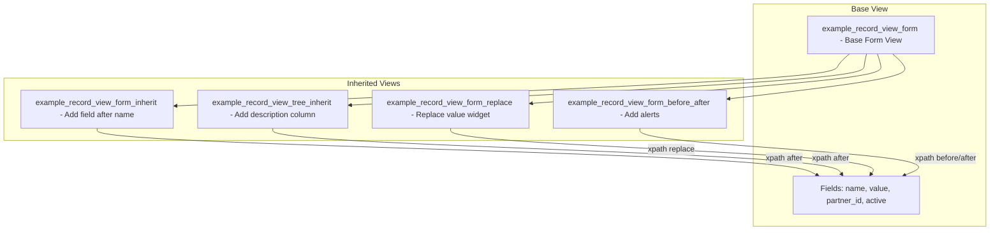

# Odoo Examples Module

This directory contains example modules demonstrating various Odoo development concepts and patterns.

## Table of Contents

- [Modules Overview](#modules-overview)
- [Architecture Diagrams](#architecture-diagrams)
- [Module Details](#module-details)
  - [blog](#blog-module)
  - [controller_test](#controller_test-module)
  - [examples_advanced](#examples_advanced-module)

## Modules Overview



## Architecture Diagrams

### Controller Inheritance Pattern



### Module Dependencies



## Module Details

### blog Module

**Purpose**: Basic blog functionality with entries and tags.

**Features**:
- Blog entry model with title, content, author, and tags
- Blog tag model for categorization
- JSON API endpoints for blog entries
- Automatic slug generation from title

**Models**:
- `blog.entry`: Blog entries with title, content, author, and tags
- `blog.tag`: Tags for categorizing blog entries

**Controllers**:
- `BlogController`: JSON API endpoints for blog operations

**API Endpoints**:
```python
POST /blog/api/entries          # Get paginated list of entries
POST /blog/api/entry/<id>       # Get specific entry details
POST /blog/api/search           # Search entries by query
```

**Inheritance Example**:
The `controller_test` module extends this controller to add additional functionality.



### controller_test Module

**Purpose**: Demonstrates controller inheritance and template inheritance patterns.

**Features**:
- Extends `BlogController` to add enhanced JSON responses
- Extends `WebsiteSale` controller to add custom values
- Template inheritance examples for website_sale templates
- JSON API statistics endpoint

**Inheritance**:

1. **Blog Controller Extension**:
   - Adds `include_content` parameter to entries endpoint
   - New `/blog/api/stats` endpoint for blog statistics

2. **WebsiteSale Controller Extension**:
   - Adds `custom_value` to checkout page
   - Adds `custom_value` to payment page

**Template Inheritance**:
- Extends `website_sale.checkout` template
- Extends `website_sale.payment` template

**API Endpoints Extended**:
```python
POST /blog/api/entries?include_content=true  # Enhanced with content
POST /blog/api/stats                         # Blog statistics
```



### examples_advanced Module

**Purpose**: Comprehensive examples of Odoo development patterns.

**Features**:

1. **Controllers**:
   - HTTP routes (public and authenticated)
   - JSON routes
   - Template rendering
   - Parameter handling

2. **QWeb Templates**:
   - Basic templates with QWeb directives
   - Template with dynamic attributes
   - Template inheritance (OWL)

3. **View Inheritance**:
   - XPath inheritance with different positions
   - Field modifications
   - Attribute modifications

4. **Reports**:
   - PDF reports with QWeb templates
   - HTML reports
   - Report template inheritance
   - Multiple document reports

**Structure**:

```
examples_advanced/
├── controllers/
│   └── main_controller.py      # HTTP and JSON routes
├── models/
│   └── example_model.py        # example.record model
├── views/
│   ├── examples_views.xml      # Base views
│   ├── examples_templates.xml  # QWeb templates
│   └── examples_inheritance_views.xml  # View inheritance
├── report/
│   ├── ir_actions_report.xml   # Report actions
│   ├── report_templates.xml    # Report templates
│   └── report_templates_inheritance.xml  # Report inheritance
└── static/src/xml/
    └── templates_inheritance.xml  # OWL template inheritance
```

**Controller Examples**:



**Report Flow**:



**View Inheritance Pattern**:



## Key Concepts Demonstrated

### 1. Controller Inheritance

Controllers in Odoo can be extended by inheriting from base controllers and overriding methods.

```python
class BaseController(Controller):
    @route('/base/endpoint')
    def base_method(self):
        return {'data': 'base'}

class ExtendedController(BaseController):
    @route('/base/endpoint')  # Same route
    def base_method(self):
        result = super().base_method()
        result['extended'] = True
        return result
```

### 2. Template Inheritance

Templates can be inherited using `inherit_id` and XPath expressions.

```xml
<template id="base_template">
    <div id="content">Base content</div>
</template>

<template id="extended_template" inherit_id="base_template">
    <xpath expr="//div[@id='content']" position="inside">
        <p>Additional content</p>
    </xpath>
</template>
```

### 3. View Inheritance

Views can be extended using XPath with different positions:
- `after`: Add after target element
- `before`: Add before target element
- `inside`: Add inside target element
- `replace`: Replace target element
- `attributes`: Modify attributes

### 4. Report Templates

Reports use QWeb templates with special layouts:
- `web.html_container`: Container for report HTML
- `web.internal_layout`: Internal document layout
- `web.external_layout`: External document layout
- `web.basic_layout`: Basic layout without header/footer

## Usage Examples

### Using Blog API from JavaScript

```javascript
// Get blog entries
odoo.define('my_module.blog_api', function (require) {
    'use strict';
    var rpc = require('web.rpc');
    
    rpc.query({
        route: '/blog/api/entries',
        params: {
            limit: 10,
            offset: 0
        }
    }).then(function (result) {
        console.log('Entries:', result.entries);
    });
});
```

### Extending Controllers

```python
from odoo.addons.examples.blog.controllers.controllers import BlogController

class MyExtendedController(BlogController):
    @route('/blog/api/entries', type='json', auth='public')
    def get_entries_json(self, **kw):
        result = super().get_entries_json(**kw)
        # Add custom logic
        return result
```

### View Inheritance Example

```xml
<record id="my_view_inherit" model="ir.ui.view">
    <field name="inherit_id" ref="module.base_view"/>
    <field name="arch" type="xml">
        <xpath expr="//field[@name='name']" position="after">
            <field name="new_field"/>
        </xpath>
    </field>
</record>
```

## Installation

1. Copy modules to `custom_addons/examples/`
2. Update module list in Odoo
3. Install desired modules:
   - `blog`: Basic blog functionality
   - `controller_test`: Controller inheritance examples
   - `examples_advanced`: Comprehensive examples

## Notes

- All examples use English for code and documentation
- Docstrings only, no inline comments
- Follows Odoo 18 conventions
- Examples are for learning purposes

## Contributing

When adding new examples:
1. Follow existing structure and naming conventions
2. Use English for all code and documentation
3. Add docstrings, avoid inline comments
4. Include inheritance examples where applicable
5. Update this README with new examples